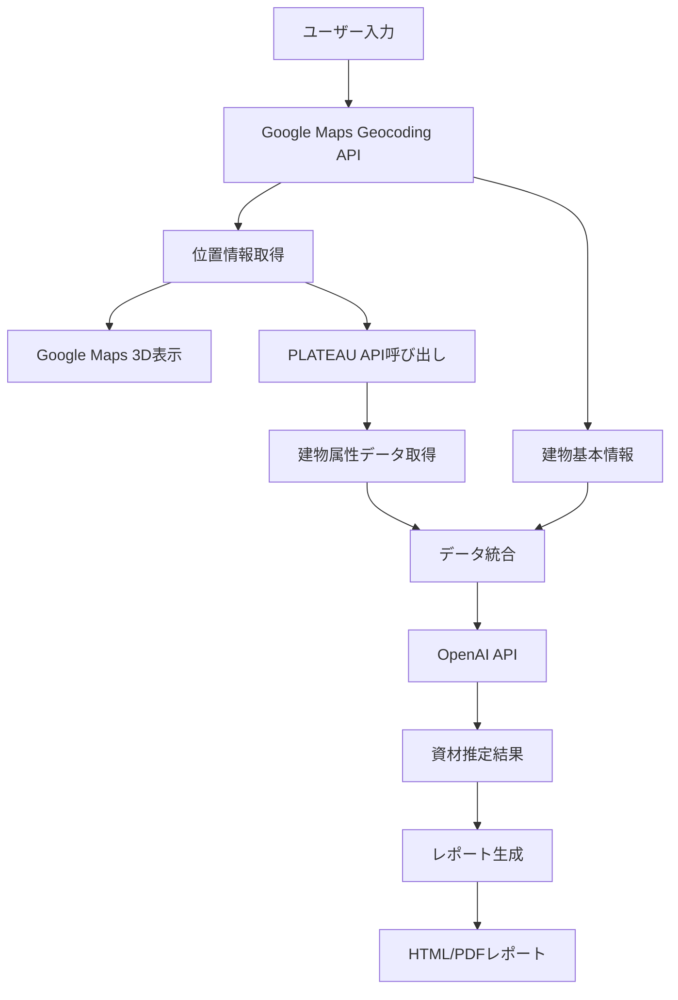

# 建物リユース資材調査アプリケーション 要件定義書

## 1. アプリケーション概要

本アプリケーションは、Google Maps API、PLATEAU配信サービス、生成AIを統合して、建物に関連するデータを収集し、リユース可能な資材情報をまとめるWebアプリケーションです。

### 目的
- 建物の解体前に、リユース可能な建築資材を特定・評価
- 環境インパクト（CO2削減量、廃棄物削減量）の推定
- 財務的価値の算出
- 視覚的で分かりやすいレポートの生成

### 成果物
- `ideas/data-of-crowneplaza_osaka.md` 形式の詳細な資材リスト
- `ideas/recycle-osaka-hotel.html` 形式のビジュアルレポート

## 2. ユーザーインターフェース構成

### 2.1 入力エリア
- **機能**: 住所または建物名を入力するテキストフィールド
- **要素**: 
  - 入力フィールド（プレースホルダー: "建物名または住所を入力"）
  - 検索ボタン
  - 自動補完機能（Google Places API利用）

### 2.2 3D建物表示エリア
- **機能**: Google Earth風の建物3D表示
- **要素**:
  - 3Dビューアー（Google Maps JavaScript API）
  - 建物を中心とした自動回転アニメーション
  - ズーム・角度調整コントロール

### 2.3 基本情報表示エリア
- **機能**: Google Maps APIから取得した建物の基本情報表示
- **表示項目**:
  - 正式名称
  - 住所（フォーマット済み）
  - 緯度・経度
  - Google Place ID
  - 建物タイプ（推定）

### 2.4 PLATEAU情報取得セクション
- **機能**: PLATEAUから建物の詳細データを取得・表示
- **要素**:
  - "PLATEAUから建物データを取得"ボタン
  - 取得データの階層的表示:
    - 基本情報（建物名称、用途、建築年）
    - 建築情報（高さ、階数、屋根タイプ）
    - 都市計画情報（建築面積、延床面積、構造種別）

### 2.5 AI資材推定セクション
- **機能**: 収集したデータを基にリユース可能資材をAIで推定
- **要素**:
  - "AIで資材を推定"ボタン
  - 推定結果の表示:
    - 構造材（鋼材、コンクリート等）
    - 外装材（ガラス、石材、金属パネル等）
    - 内装材（カーペット、家具、照明等）
    - 設備（HVAC、エレベーター、電気設備等）

### 2.6 レポート生成セクション
- **機能**: 収集・推定した全データを統合したレポート生成
- **要素**:
  - "レポート作成"ボタン
  - インラインでのHTMLレポート表示
  - ダウンロード機能

## 3. 技術要件

### 3.1 アーキテクチャ
- **設計方針**: 疎結合・モジュラー設計
- **各モジュールの独立性**: 各ステップは独立したサービスとして実装
- **インターフェース**: 明確に定義されたAPI/メソッド間通信

### 3.2 使用技術
- **フロントエンド**: 
  - HTML5/CSS3/JavaScript (ES6+)
  - Google Maps JavaScript API
  - レスポンシブデザイン対応
- **バックエンド**:
  - Node.js + Express.js
  - 環境変数管理（dotenv）
- **外部API**:
  - Google Maps API (Geocoding, Places, Maps JavaScript)
  - PLATEAU配信サービスAPI
  - OpenAI API (GPT-4)

### 3.3 拡張性
- **プラグイン構造**: 新機能を独立したモジュールとして追加可能
- **想定される拡張機能**:
  - 建物画像検索・表示（Google Street View統合）
  - 歴史情報の取得（Wikipedia API等）
  - 企業情報の取得（企業データベースAPI）
  - 類似建物の検索・比較
  - 市場価格の推定（不動産API連携）

## 4. データフロー



## 5. API仕様

### 5.1 Google Maps API連携
```javascript
// Geocoding APIレスポンス例
{
  "results": [{
    "formatted_address": "大阪府大阪市北区堂島浜1-3-1",
    "geometry": {
      "location": {
        "lat": 34.693725,
        "lng": 135.492752
      }
    },
    "place_id": "ChIJxxxxxxxxxxxxxx"
  }]
}
```

### 5.2 PLATEAU API連携
```javascript
// CityGML属性データレスポンス例
{
  "gmlId": "bldg_xxxxx",
  "attributes": {
    "bldg:usage": "商業施設",
    "bldg:yearOfConstruction": 1984,
    "bldg:measuredHeight": 96.5,
    "bldg:storeysAboveGround": 24,
    "uro:buildingFootprintArea": 1865.5
  }
}
```

### 5.3 OpenAI API連携
```javascript
// プロンプト構造
{
  "model": "gpt-4",
  "messages": [{
    "role": "system",
    "content": "建物情報から循環可能な建築資材を推定..."
  }, {
    "role": "user", 
    "content": "建物データ: [統合データ]"
  }]
}
```

## 6. セキュリティ要件

- **APIキー管理**: 環境変数での管理（.envファイル）
- **アクセス制御**: APIエンドポイントの適切な保護
- **データ検証**: ユーザー入力のサニタイゼーション
- **HTTPS通信**: 全API通信の暗号化

## 7. パフォーマンス要件

- **レスポンス時間**: 
  - Google Maps API: < 2秒
  - PLATEAU API: < 5秒
  - AI推定: < 30秒
- **キャッシュ戦略**: 
  - 建物データの一時キャッシュ
  - 推定結果の保存

## 8. 開発フェーズ

### Phase 1: 基本機能実装
1. プロジェクトセットアップ
2. Google Maps API統合
3. 基本UIの実装

### Phase 2: データ連携
4. PLATEAU API統合
5. データ統合ロジック

### Phase 3: AI統合
6. OpenAI API連携
7. 推定ロジックの実装

### Phase 4: レポート機能
8. レポート生成機能
9. UI/UXの改善

### Phase 5: 拡張機能
10. 追加機能の実装
11. テストとデバッグ
12. デプロイメント準備